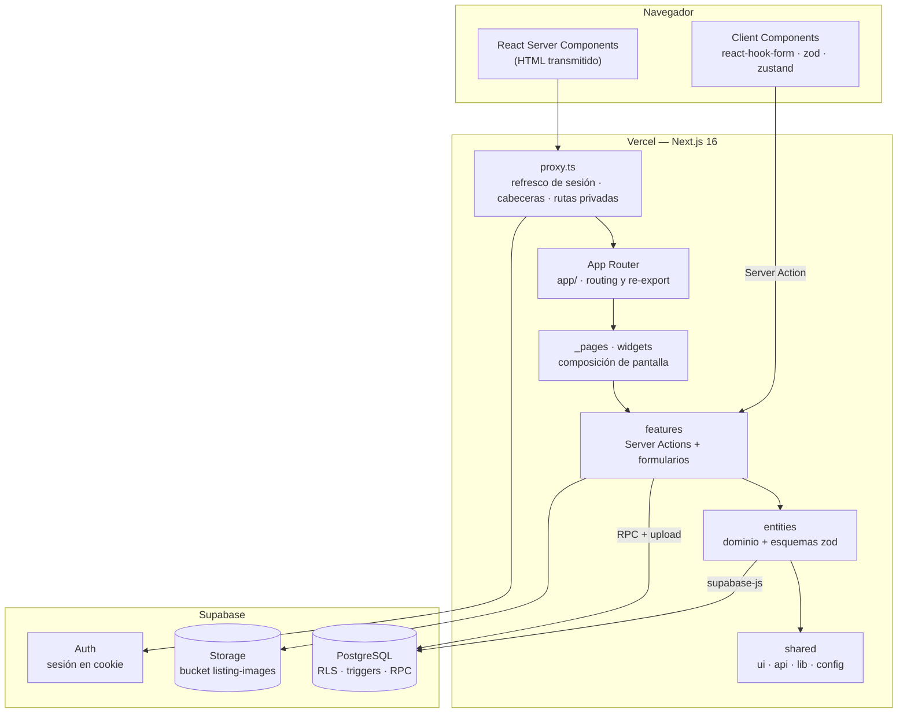
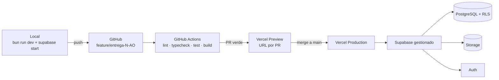
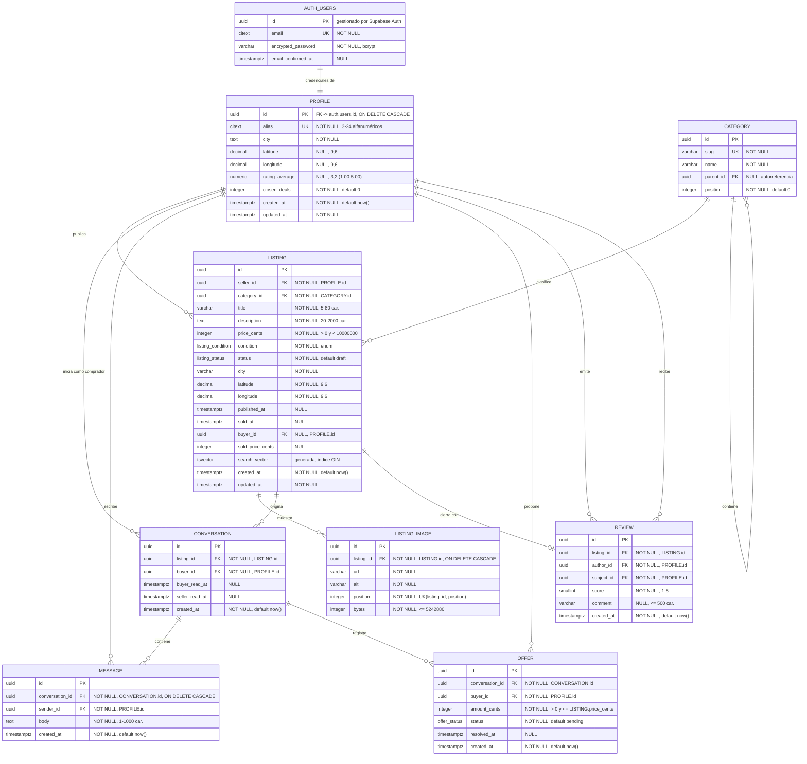

## Índice

0. [Ficha del proyecto](#0-ficha-del-proyecto)
1. [Descripción general del producto](#1-descripción-general-del-producto)
2. [Arquitectura del sistema](#2-arquitectura-del-sistema)
3. [Modelo de datos](#3-modelo-de-datos)
4. [Especificación de la API](#4-especificación-de-la-api)
5. [Historias de usuario](#5-historias-de-usuario)
6. [Tickets de trabajo](#6-tickets-de-trabajo)
7. [Pull requests](#7-pull-requests)

---

## 0. Ficha del proyecto

### **0.1. Tu nombre completo:**

Antonio Orozco

### **0.2. Nombre del proyecto:**

Loop Market

### **0.3. Descripción breve del proyecto:**

Marketplace de compraventa de artículos de segunda mano entre particulares. Loop
Market reúne en un único flujo la publicación del anuncio, la búsqueda del
comprador, la negociación del precio y el cierre de la operación, con identidad
verificada y reputación construida sobre operaciones reales.

### **0.4. URL del proyecto:**

Pendiente de despliegue público. Se publicará en Vercel durante la entrega 3.
La aplicación es ejecutable en local siguiendo las instrucciones de §1.4.

> Puede ser pública o privada, en cuyo caso deberás compartir los accesos de manera segura. Puedes enviarlos a [alvaro@lidr.co](mailto:alvaro@lidr.co) usando algún servicio como [onetimesecret](https://onetimesecret.com/).

### 0.5. URL o archivo comprimido del repositorio

https://github.com/lk321/AI4Devs-finalproject

> Puedes tenerlo alojado en público o en privado, en cuyo caso deberás compartir los accesos de manera segura. Puedes enviarlos a [alvaro@lidr.co](mailto:alvaro@lidr.co) usando algún servicio como [onetimesecret](https://onetimesecret.com/). También puedes compartir por correo un archivo zip con el contenido

---

## 1. Descripción general del producto

### **1.1. Objetivo:**

Vender un artículo usado entre particulares está hoy repartido entre grupos de
mensajería, foros y aplicaciones generalistas. El vendedor publica sin saber si
su anuncio ha llegado a alguien, y el comprador no tiene forma de distinguir una
oferta real de un intento de estafa. La negociación se pierde en conversaciones
sueltas y, cuando la operación se cierra, no queda rastro que sirva a la
siguiente.

Loop Market resuelve ese recorrido completo en un solo sitio:

- **Para quien vende**, un anuncio publicado en menos de tres minutos, con
  estado explícito (publicado, reservado, vendido) y un historial que acredita
  que cumple.
- **Para quien compra**, un catálogo filtrable por lo que de verdad decide la
  compra (precio, estado del artículo y cercanía) y un perfil de vendedor con
  valoraciones de operaciones cerradas, no de promesas.
- **Para ambos**, la negociación dentro de la plataforma, con la oferta aceptada
  registrada como acuerdo y una valoración mutua que alimenta la reputación.

El valor diferencial no es el catálogo, es el **cierre trazable**: cada
operación deja constancia y esa constancia es lo que hace confiable la
siguiente.

### **1.2. Características y funcionalidades principales:**

| # | Funcionalidad | Descripción |
| --- | --- | --- |
| 1 | Registro e inicio de sesión | Alta con email, alias y contraseña. Sesión persistente de 30 días en cookie `httpOnly`. Errores genéricos que no revelan si un email existe. |
| 2 | Perfil público | Alias, ciudad, antigüedad, valoración media, operaciones cerradas y anuncios publicados. Nunca expone email ni teléfono. |
| 3 | Publicación de anuncios | Formulario de tres pasos: artículo, fotos y precio. Hasta 8 imágenes con portada reordenable. Guardado como borrador en cualquier momento. |
| 4 | Ciclo de vida del anuncio | Estados `draft`, `published`, `reserved`, `sold`, `archived` con transiciones controladas. El precio queda bloqueado mientras el artículo está reservado. |
| 5 | Búsqueda y filtrado | Un único buscador en la cabecera, presente en todas las pantallas, que consulta al enviar y no en cada pulsación. Filtros de categoría, rango de precio, estado de conservación y distancia, con orden por relevancia, precio o fecha. |
| 6 | Búsqueda compartible | Término, filtros, orden y página viajan en la URL: la misma dirección reproduce exactamente el mismo resultado. |
| 7 | Conversación por anuncio | Un hilo único por anuncio y comprador, con indicador de mensajes sin leer y acceso limitado a los dos participantes. |
| 8 | Ofertas y reserva | El comprador propone un importe; aceptar la oferta reserva el artículo y deja el resto de ofertas superadas. La reserva se puede liberar. |
| 9 | Cierre y valoración | El vendedor marca la venta registrando comprador, importe y fecha. Ambas partes se valoran una vez, dentro de los 30 días siguientes. |

**Fuera del alcance del MVP:** pasarela de pago y custodia del dinero, logística
y envíos, aplicaciones móviles nativas, anuncios destacados de pago y moderación
automática de contenido.

### **1.3. Diseño y experiencia de usuario:**

El material visual (capturas del recorrido completo y videotutorial) se entrega
en la **entrega 3**, junto con la aplicación desplegada. El recorrido ya es
navegable en local desde la entrega 2:

```
Aterrizaje (/)
    catálogo destacado + buscador
        │
        ├── Búsqueda (/search) ──── filtros laterales, resultados paginados
        │        │
        │        └── Detalle (/listings/[id]) ── galería, precio, vendedor
        │                 │
        │                 └── "Contactar" ──► Conversación (/messages/[id])
        │                            │
        │                            └── Oferta ─► Aceptar ─► Reservado
        │                                                        │
        │                                                        └── Vendido ─► Valoración
        │
        └── Vender (/sell) ── paso 1 artículo · paso 2 fotos · paso 3 precio ─► Publicado
```

Tres decisiones de experiencia guían el diseño:

1. **El anuncio antes que la cuenta.** El formulario de venta se puede empezar
   sin sesión; las credenciales se piden en el último paso, cuando el usuario ya
   ha invertido esfuerzo.
2. **Los filtros en la URL.** Una búsqueda es un enlace: se comparte, se guarda
   en favoritos y sobrevive a la recarga.
3. **El estado siempre visible.** Publicado, reservado y vendido se muestran con
   el mismo indicador en el catálogo, en el detalle y en la conversación, para
   que nadie escriba a un artículo que ya no está disponible.

### **1.4. Instrucciones de instalación:**

**Requisitos:** Bun 1.4 o superior, Docker en ejecución (para el stack local de
Supabase) y Git.

```bash
# 1. Clonar el repositorio
git clone https://github.com/lk321/AI4Devs-finalproject.git
cd AI4Devs-finalproject

# 2. Instalar dependencias (lefthook instala los hooks en el postinstall)
bun install

# 3. Levantar Supabase en local (PostgreSQL + Auth + Storage + Studio)
bun run db:start
#    Copia los valores que imprime el comando:
#      API URL        -> NEXT_PUBLIC_SUPABASE_URL
#      publishable key -> NEXT_PUBLIC_SUPABASE_ANON_KEY

# 4. Configurar el entorno
cp .env.example .env.local
#    y pega en .env.local los dos valores del paso anterior

# 5. Aplicar migraciones y semillas (categorías, usuarios y anuncios de demo)
bun run db:reset

# 6. Arrancar
bun run dev          # http://localhost:3000
```

**Servicios locales:** aplicación en `http://localhost:3000`, API de Supabase en
`http://127.0.0.1:54321`, Studio en `http://127.0.0.1:54323` y Mailpit en
`http://127.0.0.1:54324`.

**Usuarios de demostración** (contraseña `loopmarket123`):

| Email | Alias | Ciudad |
| --- | --- | --- |
| `ana@loop.test` | `ana_ruiz` | Madrid |
| `carlos@loop.test` | `carlos_vega` | Alcobendas |
| `lucia@loop.test` | `lucia_mor` | Barcelona |

**Comprobaciones de calidad:**

```bash
bun run lint         # eslint, incluidas las reglas de capas FSD
bun run format       # prettier --write
bun run typecheck    # tsc --noEmit
bun run test         # vitest (unidad e integración)
bun run build        # build de producción
```

**Contra un proyecto Supabase alojado:** crea el proyecto, apunta
`NEXT_PUBLIC_SUPABASE_URL` y `NEXT_PUBLIC_SUPABASE_ANON_KEY` a sus valores y
aplica el esquema con `bunx supabase link --project-ref <ref>` seguido de
`bunx supabase db push`.

> Los tests de extremo a extremo con Playwright y el despliegue se incorporan en
> la entrega 3.

---

## 2. Arquitectura del Sistema

### **2.1. Diagrama de arquitectura:**



**Patrón:** monolito modular con **Feature-Sliced Design v2.1** en el interior.
Front y back comparten proceso y tipos; la separación no es física, es de capas,
y el linter la vigila.

**Por qué esta arquitectura.** El producto es un CRUD con reglas de negocio
concentradas en el ciclo de vida del anuncio y en la negociación. Separar el
backend en un servicio propio antes de tener carga que lo exija duplicaría tipos,
despliegues y contratos sin ganar nada. Next.js 16 permite leer datos desde
Server Components sin exponer endpoints y mutar con Server Actions con tipado de
extremo a extremo, así que la API HTTP queda reservada para lo que de verdad
necesita un contrato público.

Supabase aporta en un solo servicio las tres piezas externas que el MVP necesita
—PostgreSQL con migraciones versionadas, autenticación con sesión gestionada y
almacenamiento de imágenes— y, sobre todo, permite poner las invariantes **en la
base de datos**: restricciones, disparadores, funciones `security definer` y Row
Level Security. Una regla escrita ahí se cumple aunque la escriba mal la
aplicación.

FSD aporta lo que al App Router le falta: el App Router organiza **rutas**, no
**funcionalidades**. Con FSD, la respuesta a "¿dónde está el código de publicar
un anuncio?" es una sola carpeta, y la regla de importación descendente hace
imposible el ciclo entre módulos.

**Beneficios:**

- Un solo despliegue, un solo `tsconfig`, un solo conjunto de tipos, generados
  además desde el esquema real de la base (`bun run db:types`).
- Alta cohesión: una funcionalidad completa cabe en un directorio.
- Dependencias dirigidas: `_app > _pages > widgets > features > entities >
  shared`, sin ciclos posibles.
- Menos JavaScript en el cliente: Server Components por defecto, `'use client'`
  sólo en las hojas del árbol que lo necesitan.
- Autorización en la base: aunque la clave pública viaje al navegador, RLS
  decide qué filas se devuelven.

**Sacrificios asumidos:**

- **Acoplamiento a Next.js.** Las Server Actions son específicas del framework.
  Se mitiga manteniendo la lógica de dominio en `entities/*/model`, sin ningún
  import de Next: la Server Action valida y delega.
- **Lógica repartida entre SQL y TypeScript.** Los disparadores son eficaces pero
  menos visibles que el código de aplicación; se documentan en las migraciones y
  se cubren con tests.
- **Escalado conjunto.** No se puede escalar la lectura del catálogo por separado
  de la mensajería.
- **Curva de entrada de FSD.** Convenciones que hay que aprender antes de
  escribir el primer archivo; a cambio, dejan de discutirse en cada revisión.
- **Vendor lock-in parcial** con Vercel y Supabase.

### **2.2. Descripción de componentes principales:**

| Componente | Tecnología | Responsabilidad |
| --- | --- | --- |
| **App Router** (`app/`) | Next.js 16 | Routing, layouts, metadatos y streaming. No contiene lógica: re-exporta desde `_pages`. |
| **Proxy** (`proxy.ts`) | Next.js 16 | Lo que antes era el middleware. Refresca la sesión de Supabase en cada petición, aplica cabeceras de seguridad y redirige las rutas privadas al acceso. |
| **Capa `_app`** | React 19 | Shell de la aplicación: proveedores de tema, sesión, tooltips y avisos. |
| **Capa `_pages`** | React 19 Server Components | Compone una pantalla completa a partir de widgets y features. Resuelve los datos en el servidor. |
| **Capa `widgets`** | React 19 | Bloques autónomos reutilizables: cabecera, catálogo de resultados, hilo de conversación. |
| **Capa `features`** | Server Actions + react-hook-form + zod | Una intención de usuario por slice: autenticarse, publicar, filtrar, ofertar, mensajear, valorar. |
| **Capa `entities`** | TypeScript + zod + supabase-js | Objetos de negocio (`user`, `listing`) con su modelo, sus invariantes y su acceso a datos. |
| **Capa `shared`** | shadcn/ui, lucide-react, Tailwind v4 | Componentes sin dominio, clientes de Supabase, utilidades y entorno validado. |
| **Base de datos** | PostgreSQL 17 (Supabase) | Esquema, restricciones, disparadores, funciones RPC y políticas RLS. Migraciones versionadas en `supabase/migrations/`. |
| **Autenticación** | Supabase Auth | Registro, acceso, hash de contraseña y sesión en cookie, con caducidad y límite de intentos configurados en `supabase/config.toml`. |
| **Almacenamiento** | Supabase Storage | Bucket `listing-images` con límite de 5 MB, lista blanca de tipos y política de escritura por usuario. |
| **Estado de cliente** | Context API + zustand | Context para sesión y tema; zustand para el panel de filtros, donde cada pulsación cambia el estado. |
| **Calidad** | ESLint, Prettier, lefthook, commitlint | Formato y lint en `pre-commit`, typecheck y tests en `pre-push`, formato de commit en `commit-msg`. |
| **Tests** | Vitest, Testing Library | Unidad e integración junto al código. Playwright llega en la entrega 3. |

### **2.3. Descripción de alto nivel del proyecto y estructura de ficheros**

```
.
├── app/                        # App Router: SOLO routing, re-exporta _pages
│   ├── (marketing)/page.tsx
│   ├── search/page.tsx
│   ├── listings/[id]/page.tsx
│   ├── sell/page.tsx
│   ├── messages/[id]/page.tsx
│   └── api/
│       ├── auth/[...route]/route.ts
│       ├── listings/route.ts
│       └── uploads/route.ts
├── src/
│   ├── _app/                   # providers, estilos globales, arranque
│   ├── _pages/                 # una carpeta por pantalla
│   │   ├── home/
│   │   ├── search/
│   │   ├── listing-detail/
│   │   └── sell/
│   ├── widgets/
│   │   ├── listing-catalog/
│   │   ├── conversation-thread/
│   │   └── site-header/
│   ├── features/
│   │   ├── auth-by-credentials/
│   │   ├── create-listing/
│   │   ├── filter-listings/
│   │   ├── send-message/
│   │   └── make-offer/
│   ├── entities/
│   │   ├── user/
│   │   │   ├── model/          # tipos, esquemas zod, invariantes
│   │   │   ├── api/            # consultas a Supabase
│   │   │   ├── ui/             # tarjeta de perfil, avatar
│   │   │   └── index.ts
│   │   └── listing/
│   └── shared/
│       ├── ui/                 # shadcn/ui
│       ├── api/                # clientes de Supabase + tipos generados
│       ├── lib/                # utilidades sin dominio
│       └── config/             # entorno validado con zod
├── supabase/
│   ├── config.toml
│   ├── migrations/
│   └── seed.sql
├── e2e/                        # Playwright
├── openspec/                   # especificaciones del producto
│   ├── config.yaml
│   └── changes/add-marketplace-mvp/
│       ├── proposal.md
│       ├── design.md
│       ├── tasks.md
│       └── specs/
├── AGENTS.md                   # instrucciones para asistentes de código
├── lefthook.yml
└── readme.md
```

**Patrón: Feature-Sliced Design v2.1.** Tres conceptos:

- **Capas** (vertical): `_app`, `_pages`, `widgets`, `features`, `entities`,
  `shared`. Las capas FSD `app` y `pages` se renombran con guion bajo porque
  `app/` en la raíz pertenece al App Router.
- **Slices** (horizontal): división por dominio dentro de una capa
  (`listing`, `user`, `create-listing`…).
- **Segmentos** (técnico): dentro de un slice, `ui`, `model`, `api`, `lib`,
  `config`.

**Reglas de importación:**

1. Una capa sólo importa de capas **estrictamente inferiores**.
2. Dos slices de la misma capa **nunca** se importan entre sí.
3. Todo slice expone su API pública por `index.ts`; nadie accede a rutas
   internas.
4. El código exclusivo de servidor se exporta por `index.server.ts`, para que el
   grafo de cliente no arrastre el cliente de servidor ni los secretos.

Las reglas 1 y 2 están aplicadas por ESLint: violarlas rompe el build.

**Navegación y prefetching.** La estrategia se apoya en cuatro mecanismos del
App Router, combinados para que al pulsar un enlace la vista ya esté en el
cliente:

| Mecanismo | Dónde | Qué consigue |
| --- | --- | --- |
| `<Link>` con prefetch automático | tarjetas del catálogo, cabecera, bandeja de mensajes | Next.js precarga la ruta en cuanto el enlace entra en el viewport y prioriza las que muestran intención (hover o toque). |
| Búsqueda por envío explícito | buscador de la cabecera | El término viaja a la URL al pulsar Enter, no en cada tecla: escribir una palabra de nueve letras cuesta **una** consulta al servidor en lugar de nueve. |
| `useRouter().prefetch()` en `onMouseEnter` | paginación del catálogo, conversaciones, acciones del vendedor, buscador de la cabecera | Los botones no son enlaces, así que la precarga se dispara a mano cuando el puntero se acerca. |
| `loading.tsx` en todas las rutas dinámicas | `/search`, `/listings/[id]`, `/messages`, `/messages/[id]`, `/profile/[alias]`, `/account/listings` | Habilita el **prefetch parcial**: sin él, Next.js omite la precarga de una ruta dinámica. Además da transición inmediata con esqueleto en vez de una pantalla congelada. |
| Server Components con datos ya resueltos | `_pages/*` | El HTML llega poblado desde el servidor: el cliente no encadena un `fetch` después de montar, así que no hay salto de contenido ni estado de carga en el camino feliz. |

El prefetching automático **sólo actúa en producción** (`bun run build && bun run
start`); en desarrollo Next.js lo desactiva a propósito.

### **2.4. Infraestructura y despliegue**



**Entorno local.** `bun run db:start` levanta con Docker el stack completo de
Supabase: PostgreSQL, Auth, Storage, Studio y Mailpit. `bun run db:reset` aplica
las migraciones de `supabase/migrations/` y la semilla de `supabase/seed.sql`, de
modo que el entorno de desarrollo reproduce el de producción, no lo aproxima.

**Proceso de despliegue:**

1. Los hooks de `lefthook` ejecutan formato y lint en `pre-commit`, y typecheck y
   tests en `pre-push`, así que el pipeline rara vez falla por estilo.
2. Cada `push` dispara `lint`, `typecheck`, `test` y `build`.
3. Vercel genera un **despliegue de vista previa** por Pull Request.
4. El merge a `main` promociona a producción. El esquema se aplica al proyecto
   Supabase con `supabase db push`.
5. **Rollback:** promoción del despliegue anterior en Vercel; si la migración fue
   destructiva, una migración correctiva en Supabase.

**Entornos:** `local` (Supabase en Docker), `preview` (proyecto Supabase de
pruebas) y `production`. Los secretos viven en las variables de entorno de Vercel
y **se validan con zod al arrancar** (`src/shared/config/env.ts`): si falta una,
la aplicación no levanta.

### **2.5. Seguridad**

| Práctica | Implementación |
| --- | --- |
| **Row Level Security** | Activo en las ocho tablas. Un anuncio en `draft` sólo lo devuelve la base a su autor; un hilo de conversación, sólo a sus dos participantes. La clave pública del navegador no da acceso a nada que la política no permita. |
| **Contraseñas** | Las gestiona Supabase Auth con hash bcrypt: la aplicación nunca las ve, ni las registra, ni las devuelve. Mínimo de 12 caracteres (`minimum_password_length = 12`). |
| **Sesión** | Cookies `httpOnly`, `secure`, `sameSite=lax` emitidas por Supabase y refrescadas en `proxy.ts`. Caducidad máxima de 30 días (`timebox = "720h"`). Inaccesibles desde JavaScript, lo que anula el robo de sesión por XSS. |
| **Enumeración de cuentas** | El error de acceso es idéntico para email inexistente y contraseña incorrecta: *"Email o contraseña incorrectos"*. |
| **Fuerza bruta** | `sign_in_sign_ups = 10`: como máximo 10 peticiones de acceso o registro por IP cada 5 minutos. |
| **Validación de entrada** | Esquema zod único por feature: lo usa el formulario en cliente y lo vuelve a parsear la Server Action en servidor. Además, la base impone `CHECK` sobre precio, longitudes y puntuaciones. Un precio negativo enviado a mano se rechaza tres veces. |
| **Autorización** | Comprobada en la base, no sólo en el código: las funciones `resolve_offer`, `mark_listing_sold` y `release_reservation` verifican que quien llama es el vendedor antes de escribir. |
| **Transiciones de estado** | Un disparador rechaza cualquier transición fuera de la máquina de estados y el cambio de precio con el anuncio reservado, aunque la aplicación lo intente. |
| **Subida de archivos** | Bucket `listing-images` con lista blanca (`image/jpeg`, `image/png`, `image/webp`), 5 MB por archivo y política que exige que la ruta empiece por el identificador del propio usuario. |
| **Datos personales** | Las consultas de perfil seleccionan una lista explícita de columnas públicas: email y teléfono no salen nunca de la base. |
| **Secretos** | Variables de entorno validadas con zod al arrancar. `.env*` está en `.gitignore`. Sólo se publica al navegador la clave `anon`, cuyo alcance lo limita RLS. |
| **Cabeceras** | `X-Content-Type-Options`, `Referrer-Policy`, `X-Frame-Options` y `Permissions-Policy` aplicadas en `proxy.ts`. |
| **Redirecciones** | El parámetro `?next=` del acceso sólo se acepta si es una ruta interna, para evitar redirección abierta. |

### **2.6. Tests**

La especificación es la fuente de los tests: cada `#### Scenario:` de
`openspec/changes/add-marketplace-mvp/specs/` da nombre a un test.

**Unidad (Vitest).** Invariantes de dominio sin tocar la base de datos:

- `listingDraftSchema` rechaza títulos de menos de 5 caracteres, precios no
  positivos, precios de 100.000 € o más y más de 8 imágenes.
- `canTransition` acepta `published → reserved` y rechaza `draft → sold`.
- `parseSearchParams` ignora un rango de precio invertido, tolera un criterio de
  orden desconocido y acepta condiciones separadas por coma.
- `toQueryString` omite los valores por defecto y serializa sólo lo activo.

**Componente (Testing Library).** Comportamiento observable por rol accesible,
nunca por clase CSS: formularios que no avanzan con campos inválidos, errores
mostrados junto a su control, y el panel de filtros que no rerenderiza las
tarjetas de resultado al cambiar un filtro.

**Servidor.** Las Server Actions se prueban contra entrada manipulada: precio
negativo, autoría ajena, oferta superior al precio, mensaje vacío o de más de
1000 caracteres.

**Base de datos.** Las restricciones se verifican contra la instancia local:
alias duplicado, segunda conversación del mismo comprador sobre el mismo anuncio,
segunda oferta pendiente, valoración duplicada y transición de estado inválida.

**Extremo a extremo (Playwright).** Llega en la entrega 3, sobre los tres
recorridos críticos: publicar, buscar y cerrar una operación.

---

## 3. Modelo de Datos

### **3.1. Diagrama del modelo de datos:**

Las credenciales viven en el esquema `auth` que gestiona Supabase. `PROFILE` es
la proyección pública de `auth.users`, enlazada por clave primaria compartida y
creada por el disparador `handle_new_user`. Las ocho tablas de `public` tienen
**Row Level Security activo**.



### **3.2. Descripción de entidades principales:**

#### PROFILE

Proyección pública de una persona registrada. Las credenciales (email y hash de
contraseña) viven en `auth.users`, gestionada por Supabase Auth; `PROFILE`
comparte su clave primaria y la crea el disparador `handle_new_user`. Un usuario
actúa indistintamente como vendedor y como comprador: no hay roles separados.

| Atributo | Tipo | Restricciones | Descripción |
| --- | --- | --- | --- |
| `id` | `uuid` | **PK**, **FK** → `auth.users.id`, ON DELETE CASCADE | Mismo identificador que la cuenta de autenticación. |
| `alias` | `citext` | **UNIQUE**, NOT NULL, `^[a-zA-Z0-9_]{3,24}$` | Identidad pública y segmento de URL del perfil. |
| `city` | `text` | NOT NULL | Ciudad declarada, base del filtro por distancia. |
| `latitude` / `longitude` | `numeric(9,6)` | NULL | Centroide de la ciudad, no la ubicación exacta. |
| `rating_average` | `numeric(3,2)` | NULL, 1.00-5.00 | Media de las valoraciones recibidas, recalculada por disparador. `NULL` mientras no hay ninguna. |
| `closed_deals` | `integer` | NOT NULL, default 0 | Operaciones cerradas, incrementado por disparador al marcar una venta. |
| `created_at` | `timestamptz` | NOT NULL | Antigüedad mostrada en el perfil. |
| `updated_at` | `timestamptz` | NOT NULL | Mantenido por disparador. |

**Políticas RLS:** lectura pública; inserción y actualización sólo del propio
perfil (`auth.uid() = id`). El email nunca está en esta tabla, así que ninguna
consulta pública puede filtrarlo.

**Relaciones:** 1:1 con `auth.users`; 1:N con `LISTING` (como vendedor y,
opcionalmente, como comprador), `CONVERSATION`, `MESSAGE`, `OFFER` y `REVIEW`
(como autor y como sujeto).

#### CATEGORY

Taxonomía jerárquica en dos niveles. Se carga por semillas; no la edita el
usuario.

| Atributo | Tipo | Restricciones | Descripción |
| --- | --- | --- | --- |
| `id` | `uuid` | **PK** | Identificador. |
| `slug` | `varchar(60)` | **UNIQUE**, NOT NULL | Segmento de URL y clave del filtro. |
| `name` | `varchar(80)` | NOT NULL | Nombre mostrado. |
| `parent_id` | `uuid` | **FK** → `CATEGORY.id`, NULL | Autorreferencia. `NULL` en las categorías raíz. |
| `position` | `integer` | NOT NULL, default 0 | Orden de presentación. |

**Relaciones:** 1:N consigo misma (padre-hijas) y 1:N con `LISTING`.

#### LISTING

Anuncio de un artículo. Es la entidad central: concentra el ciclo de vida y el
resultado de la operación.

| Atributo | Tipo | Restricciones | Descripción |
| --- | --- | --- | --- |
| `id` | `uuid` | **PK** | Identificador. |
| `seller_id` | `uuid` | **FK** → `USER.id`, NOT NULL | Autor. Único que puede editar o cambiar el estado. |
| `category_id` | `uuid` | **FK** → `CATEGORY.id`, NOT NULL | Categoría hoja. |
| `title` | `varchar(80)` | NOT NULL, 5-80 car. | Indexado para búsqueda por texto. |
| `description` | `text` | NOT NULL, 20-2000 car. | Indexado para búsqueda por texto. |
| `price_cents` | `integer` | NOT NULL, > 0, < 10.000.000 | Precio en céntimos: sin decimales binarios, sin errores de redondeo. |
| `condition` | `enum` | NOT NULL | `nuevo`, `como_nuevo`, `bueno`, `aceptable`, `para_piezas`. |
| `status` | `enum` | NOT NULL, default `draft` | `draft`, `published`, `reserved`, `sold`, `archived`. |
| `city` | `varchar(80)` | NOT NULL | Ubicación del artículo. |
| `latitude` / `longitude` | `decimal(9,6)` | NOT NULL | Centroide de la ciudad para el filtro por distancia. |
| `published_at` | `timestamptz` | NULL | Se fija al publicar. Criterio del orden por novedad. |
| `sold_at` | `timestamptz` | NULL | Se fija al cerrar. Abre la ventana de 30 días de valoración. |
| `buyer_id` | `uuid` | **FK** → `USER.id`, NULL | Comprador final. `NOT NULL` obligatorio cuando `status = sold`. |
| `sold_price_cents` | `integer` | NULL | Importe realmente acordado, que puede diferir de `price_cents`. |

**Restricciones adicionales:** `CHECK (status <> 'sold' OR (buyer_id IS NOT NULL
AND sold_at IS NOT NULL AND sold_price_cents IS NOT NULL))` y
`CHECK (buyer_id <> seller_id)`.

**Columna generada:** `search_vector tsvector` calculada como
`to_tsvector('spanish', immutable_unaccent(title || ' ' || description))`, lo que
hace la búsqueda insensible a acentos y mayúsculas sin trabajo en la aplicación.

**Índices:** `(status, published_at DESC)` para el catálogo,
`(category_id, price_cents)` para el filtro combinado más frecuente,
`(seller_id, status)` para el panel del vendedor y un índice GIN sobre
`search_vector` para la búsqueda por texto.

**Disparadores:** `enforce_listing_transition` rechaza cualquier transición fuera
de la máquina de estados y el cambio de precio con el anuncio en `reserved`;
`require_listing_images` impide publicar un borrador sin imágenes;
`count_closed_deals` incrementa el contador de ambas partes al pasar a `sold`.

**Políticas RLS:** lectura pública de `published`, `reserved` y `sold`, más los
propios en cualquier estado; inserción, actualización y borrado sólo del autor.

**Relaciones:** N:1 con `USER` y `CATEGORY`; 1:N con `LISTING_IMAGE` (borrado en
cascada) y `CONVERSATION`; 1:0..2 con `REVIEW`.

#### LISTING_IMAGE

Imagen de un anuncio. Entidad propia porque el orden es dato de negocio: la
posición 0 es la portada.

| Atributo | Tipo | Restricciones | Descripción |
| --- | --- | --- | --- |
| `id` | `uuid` | **PK** | Identificador. |
| `listing_id` | `uuid` | **FK** → `LISTING.id`, NOT NULL, ON DELETE CASCADE | Anuncio al que pertenece. |
| `url` | `varchar(500)` | NOT NULL | Ubicación en el blob storage. |
| `alt` | `varchar(140)` | NOT NULL | Texto alternativo, obligatorio por accesibilidad. |
| `position` | `integer` | NOT NULL, **UNIQUE** `(listing_id, position)`, 0-7 | Orden en la galería. 0 es la portada. |
| `bytes` | `integer` | NOT NULL, ≤ 5.242.880 | Tamaño; refuerza en base de datos el límite de 5 MB. |

#### CONVERSATION

Hilo entre el comprador y el vendedor sobre un anuncio concreto.

| Atributo | Tipo | Restricciones | Descripción |
| --- | --- | --- | --- |
| `id` | `uuid` | **PK** | Identificador. |
| `listing_id` | `uuid` | **FK** → `LISTING.id`, NOT NULL | Anuncio negociado. |
| `buyer_id` | `uuid` | **FK** → `USER.id`, NOT NULL | Comprador interesado. |
| `buyer_read_at` / `seller_read_at` | `timestamptz` | NULL | Última lectura de cada parte; base del contador de no leídos. |

**Restricciones:** **UNIQUE** `(listing_id, buyer_id)` — un solo hilo por anuncio
y comprador, que es la regla que impide duplicar conversaciones. El vendedor se
deduce de `LISTING.seller_id` y no se duplica aquí.

**Políticas RLS:** sólo los dos participantes leen la conversación y sus
mensajes; la función `is_listing_participant` centraliza esa comprobación.

#### MESSAGE

Mensaje de texto dentro de una conversación.

| Atributo | Tipo | Restricciones | Descripción |
| --- | --- | --- | --- |
| `id` | `uuid` | **PK** | Identificador. |
| `conversation_id` | `uuid` | **FK** → `CONVERSATION.id`, NOT NULL, ON DELETE CASCADE | Hilo. |
| `sender_id` | `uuid` | **FK** → `USER.id`, NOT NULL | Autor; debe ser uno de los dos participantes. |
| `body` | `text` | NOT NULL, 1-1000 car. | Contenido. |
| `created_at` | `timestamptz` | NOT NULL | Orden cronológico. Indexado junto a `conversation_id`. |

#### OFFER

Propuesta de precio del comprador dentro de una conversación.

| Atributo | Tipo | Restricciones | Descripción |
| --- | --- | --- | --- |
| `id` | `uuid` | **PK** | Identificador. |
| `conversation_id` | `uuid` | **FK** → `CONVERSATION.id`, NOT NULL | Hilo donde se negocia. |
| `buyer_id` | `uuid` | **FK** → `USER.id`, NOT NULL | Quien propone. |
| `amount_cents` | `integer` | NOT NULL, > 0, ≤ `LISTING.price_cents` | Importe ofrecido. |
| `status` | `enum` | NOT NULL, default `pending` | `pending`, `accepted`, `rejected`, `superseded`. |
| `resolved_at` | `timestamptz` | NULL | Momento de aceptación, rechazo o sustitución. |

**Restricciones:** índice único parcial sobre `(conversation_id)` donde
`status = 'pending'` — sólo una oferta viva por conversación. El disparador
`enforce_offer_rules` comprueba que el anuncio admite ofertas, que el importe no
supera el precio y marca como `superseded` la oferta pendiente anterior.

#### REVIEW

Valoración emitida tras cerrar una operación.

| Atributo | Tipo | Restricciones | Descripción |
| --- | --- | --- | --- |
| `id` | `uuid` | **PK** | Identificador. |
| `listing_id` | `uuid` | **FK** → `LISTING.id`, NOT NULL | Operación valorada; debe estar en `sold`. |
| `author_id` | `uuid` | **FK** → `USER.id`, NOT NULL | Quien valora. |
| `subject_id` | `uuid` | **FK** → `USER.id`, NOT NULL | Quien recibe la valoración. |
| `score` | `smallint` | NOT NULL, 1-5 | Puntuación. |
| `comment` | `varchar(500)` | NULL | Comentario opcional. |

**Restricciones:** **UNIQUE** `(listing_id, author_id)` — una sola valoración por
operación y autor; `CHECK (author_id <> subject_id)`. La política RLS de
inserción exige además que el anuncio esté en `sold`, que hayan pasado menos de
30 días desde `sold_at` y que autor y sujeto sean las dos partes de la operación:
la ventana no depende del código de aplicación. El disparador
`recalculate_rating` actualiza la media del perfil valorado.

---

## 4. Especificación de la API

Las mutaciones de la aplicación viajan por **Server Actions**, con tipado de
extremo a extremo y sin contrato HTTP que mantener. El contrato HTTP público es
el que expone Supabase sobre PostgREST: las funciones RPC definidas en las
migraciones. Autenticación por `Authorization: Bearer <access_token>` más la
cabecera `apikey`; **Row Level Security decide qué filas devuelve cada llamada**.

Estos son los tres endpoints principales.

```yaml
openapi: 3.1.0
info:
  title: Loop Market API
  version: 1.0.0
  description: Funciones RPC expuestas por PostgREST sobre el esquema public.
servers:
  - url: https://<project-ref>.supabase.co/rest/v1
  - url: http://127.0.0.1:54321/rest/v1

paths:
  /rpc/search_listings:
    post:
      summary: Buscar anuncios publicados
      description: >-
        Devuelve una página de anuncios en estado published o reserved que cumplen
        los filtros, con la distancia al origen y el total de coincidencias en
        cada fila. No requiere sesión.
      security: [{ apiKey: [] }]
      requestBody:
        required: true
        content:
          application/json:
            schema:
              type: object
              properties:
                search_term: { type: string, nullable: true, description: Texto libre, insensible a acentos y mayúsculas }
                category_slug: { type: string, nullable: true }
                min_price: { type: integer, nullable: true, description: Céntimos }
                max_price: { type: integer, nullable: true, description: Céntimos }
                conditions:
                  type: array
                  nullable: true
                  items: { type: string, enum: [nuevo, como_nuevo, bueno, aceptable, para_piezas] }
                origin_lat: { type: number, nullable: true }
                origin_lng: { type: number, nullable: true }
                max_distance_km: { type: integer, nullable: true, minimum: 1, maximum: 500 }
                sort_by: { type: string, enum: [relevance, price_asc, price_desc, newest], default: relevance }
                page_number: { type: integer, minimum: 1, default: 1 }
                page_size: { type: integer, default: 24 }
      responses:
        '200':
          description: Página de resultados
          content:
            application/json:
              schema:
                type: array
                items: { $ref: '#/components/schemas/ListingSummary' }

  /rpc/start_conversation:
    post:
      summary: Abrir o recuperar la conversación de un anuncio
      description: >-
        Idempotente: si el comprador ya tiene un hilo sobre ese anuncio devuelve
        el existente. Rechaza al propio vendedor y los anuncios que ya no admiten
        mensajes.
      security: [{ sessionBearer: [] }]
      requestBody:
        required: true
        content:
          application/json:
            schema:
              type: object
              required: [target_listing]
              properties:
                target_listing: { type: string, format: uuid }
      responses:
        '200':
          description: Identificador de la conversación
          content:
            application/json:
              schema: { type: string, format: uuid }
        '401': { $ref: '#/components/responses/Unauthorized' }
        '403': { description: El vendedor no puede conversar con su propio anuncio }
        '400': { description: El anuncio ya no admite mensajes }

  /rpc/resolve_offer:
    post:
      summary: Aceptar o rechazar una oferta
      description: >-
        Sólo el vendedor del anuncio. Aceptar deja el anuncio en reserved, fija el
        comprador y el importe acordado, y marca como superseded el resto de
        ofertas pendientes, todo en la misma transacción.
      security: [{ sessionBearer: [] }]
      requestBody:
        required: true
        content:
          application/json:
            schema:
              type: object
              required: [target_offer, accept]
              properties:
                target_offer: { type: string, format: uuid }
                accept: { type: boolean }
      responses:
        '204': { description: Oferta resuelta }
        '401': { $ref: '#/components/responses/Unauthorized' }
        '403': { description: Solo el vendedor resuelve la oferta }
        '404': { description: Oferta no encontrada o ya resuelta }

components:
  securitySchemes:
    apiKey:
      type: apiKey
      in: header
      name: apikey
    sessionBearer:
      type: http
      scheme: bearer
      bearerFormat: JWT

  responses:
    Unauthorized:
      description: Sesión requerida o expirada

  schemas:
    ListingSummary:
      type: object
      required: [id, title, price_cents, condition, status, city, total_count]
      properties:
        id: { type: string, format: uuid }
        title: { type: string }
        price_cents: { type: integer }
        condition: { type: string, enum: [nuevo, como_nuevo, bueno, aceptable, para_piezas] }
        status: { type: string, enum: [published, reserved] }
        city: { type: string }
        distance_km: { type: number, nullable: true }
        cover_url: { type: string, format: uri, nullable: true }
        cover_alt: { type: string, nullable: true }
        published_at: { type: string, format: date-time }
        total_count: { type: integer, description: Total de coincidencias de la búsqueda completa }
```

**Ejemplo — buscar bicicletas de hasta 300 € a menos de 25 km de Madrid**

```http
POST /rest/v1/rpc/search_listings
apikey: <publishable-key>
Content-Type: application/json

{
  "search_term": "bicicleta",
  "category_slug": "deporte",
  "max_price": 30000,
  "origin_lat": 40.4168,
  "origin_lng": -3.7038,
  "max_distance_km": 25,
  "sort_by": "price_asc"
}
```

```json
[
  {
    "id": "44444444-0000-4000-8000-000000000001",
    "title": "Bicicleta de montaña 27,5 pulgadas",
    "price_cents": 18000,
    "condition": "bueno",
    "status": "published",
    "city": "Madrid",
    "distance_km": 0.0,
    "cover_url": "https://images.unsplash.com/photo-1485965120184-e220f721d03e?auto=format&fit=crop&w=1200&q=70",
    "cover_alt": "Bicicleta de montaña 27,5 pulgadas",
    "published_at": "2026-09-12T09:31:04.306Z",
    "total_count": 1
  }
]
```

**Ejemplo — abrir la conversación de un anuncio**

```http
POST /rest/v1/rpc/start_conversation
apikey: <publishable-key>
Authorization: Bearer <access-token>
Content-Type: application/json

{ "target_listing": "44444444-0000-4000-8000-000000000003" }
```

```json
"3a4b5c6d-7e8f-4a1b-9c2d-3e4f5a6b7c8d"
```

Una segunda llamada del mismo comprador sobre el mismo anuncio devuelve ese mismo
identificador: no crea un hilo nuevo.

---

## 5. Historias de Usuario

Las historias se gestionan con **OpenSpec** en
`openspec/changes/add-marketplace-mvp/specs/`, donde cada criterio de aceptación
es un `#### Scenario:` que se traduce directamente en un test. A continuación,
las tres principales.

**Historia de Usuario 1**

> **Como** persona que quiere deshacerse de un artículo que ya no usa,
> **quiero** publicar un anuncio con fotos, precio y estado en pocos minutos,
> **para** que quien lo necesite pueda encontrarlo y contactarme sin que yo tenga
> que perseguir a nadie.

*Spec: `marketplace/listings`*

**Criterios de aceptación**

- **Dado** que tengo sesión iniciada, **cuando** completo título, descripción,
  precio, categoría, estado y ciudad y subo al menos una foto, **entonces** el
  anuncio se guarda como borrador y veo su vista previa.
- **Dado** un borrador completo, **cuando** pulso "Publicar", **entonces** el
  anuncio pasa a `published`, registra la fecha y aparece en el catálogo de
  inmediato.
- **Dado** un formulario con el título de menos de 5 caracteres o el precio a
  cero, **cuando** intento avanzar, **entonces** no avanzo y veo el error junto
  a cada campo afectado.
- **Dado** que subo una novena foto, **cuando** se procesa, **entonces** se
  rechaza indicando el máximo de 8.
- **Dado** que arrastro una foto a la primera posición, **cuando** guardo,
  **entonces** esa foto pasa a ser la portada.
- **Dado** que no tengo sesión, **cuando** intento publicar, **entonces** se me
  redirige al acceso y, al autenticarme, vuelvo al formulario con lo escrito.

**Notas:** el precio se valida también en servidor; un envío manipulado con
precio negativo se rechaza sin persistir nada.

**Estimación:** 8 puntos · **Prioridad:** imprescindible

---

**Historia de Usuario 2**

> **Como** persona que busca un artículo concreto de segunda mano,
> **quiero** filtrar el catálogo por precio, estado y cercanía,
> **para** ver sólo lo que puedo permitirme y recoger sin desplazarme medio país.

*Spec: `marketplace/search`*

**Criterios de aceptación**

- **Dado** el catálogo publicado, **cuando** busco "bicicleta", **entonces** veo
  los anuncios visibles cuyo título o descripción contienen el término, sin que
  importen acentos ni mayúsculas.
- **Dado** un resultado de búsqueda, **cuando** aplico categoría "deporte",
  precio entre 50 y 200 € y estado "como nuevo", **entonces** sólo veo los
  anuncios que cumplen las tres condiciones a la vez.
- **Dado** que indico Madrid y 25 km, **cuando** se aplica el filtro,
  **entonces** desaparecen los anuncios cuya ciudad está más lejos.
- **Dado** un conjunto de filtros aplicados, **cuando** recargo la página o
  comparto la URL, **entonces** se reproduce exactamente la misma búsqueda.
- **Dado** que hay 60 coincidencias, **cuando** paso a la página 2, **entonces**
  veo los resultados 25 a 48 y el total de 60.
- **Dado** que ningún anuncio coincide, **cuando** se muestra el resultado,
  **entonces** veo un estado vacío que sugiere ampliar la búsqueda.
- **Dado** un anuncio en borrador, vendido o archivado, **cuando** coincide con
  el término, **entonces** no aparece en los resultados.

**Notas:** los filtros viven en un store de zustand precisamente para que
cambiar uno no rerenderice las tarjetas de resultado.

**Estimación:** 5 puntos · **Prioridad:** imprescindible

---

**Historia de Usuario 3**

> **Como** comprador interesado en un artículo,
> **quiero** negociar el precio con el vendedor y cerrar el acuerdo dentro de la
> plataforma,
> **para** tener constancia de lo pactado y no depender de conversaciones
> sueltas en otra aplicación.

*Spec: `marketplace/transactions`*

**Criterios de aceptación**

- **Dado** un anuncio publicado que no es mío, **cuando** envío el primer
  mensaje, **entonces** se crea la conversación y aparece en la bandeja de
  ambos.
- **Dado** que ya escribí sobre ese anuncio, **cuando** vuelvo a escribir,
  **entonces** se reutiliza el hilo existente en lugar de crear otro.
- **Dado** un anuncio de 100 €, **cuando** ofrezco 80 €, **entonces** la oferta
  queda pendiente y visible en el hilo; si ofrezco más de 100 €, se rechaza.
- **Dado** que tengo una oferta pendiente, **cuando** envío otra, **entonces** la
  anterior queda superada y sólo la nueva sigue viva.
- **Dado** que soy el vendedor, **cuando** acepto una oferta, **entonces** el
  anuncio pasa a reservado, el resto de ofertas quedan superadas y el precio se
  bloquea.
- **Dado** un anuncio reservado, **cuando** el vendedor lo marca como vendido,
  **entonces** se registran comprador, importe y fecha, y se habilita la
  valoración para ambos.
- **Dado** que la operación se cerró hace menos de 30 días, **cuando** valoro con
  1 a 5 estrellas, **entonces** se guarda y se recalcula la media del perfil
  valorado; una segunda valoración mía sobre la misma operación se rechaza.
- **Dado** que no participo en una conversación, **cuando** intento abrirla,
  **entonces** recibo un error de autorización.

**Estimación:** 13 puntos · **Prioridad:** imprescindible

---

## 6. Tickets de Trabajo

**Ticket 1 — Backend**

| | |
| --- | --- |
| **ID** | `LM-041` |
| **Título** | Server Action de creación de anuncio con validación en servidor |
| **Tipo** | Backend |
| **Historia** | HU-1 · Spec `marketplace/listings` |
| **Estimación** | 6 h |
| **Prioridad** | Alta |

**Descripción**

Implementar la Server Action que crea un anuncio en estado `draft` a nombre del
usuario autenticado. La acción es la única puerta de escritura: la validación de
cliente no se considera barrera de seguridad.

**Criterios de aceptación**

1. La acción exige sesión; sin ella devuelve error de autorización sin tocar la
   base de datos.
2. La entrada se parsea con el esquema zod de
   `features/create-listing/model/schema.ts`, el mismo que usa el formulario.
3. Se rechazan: título fuera de 5-80 caracteres, descripción fuera de 20-2000,
   `priceCents` ≤ 0 o ≥ 10.000.000, categoría inexistente, estado de conservación
   fuera del enumerado y lista de imágenes vacía o de más de 8.
4. Los errores se devuelven como lista `{ path, message }` que el formulario
   asocia a cada campo.
5. En el caso correcto se crea el `Listing` con `status = draft` y sus
   `ListingImage` con `position` 0..n **en una sola transacción**.
6. `seller_id` se toma de la sesión, **nunca** del cuerpo de la petición.

**Detalle técnico**

- Ubicación: `src/features/create-listing/api/create-listing-action.ts`.
- La lógica de dominio vive en `src/entities/listing/model/` y no importa nada de
  Next: la acción valida y delega.
- Escritura del anuncio y sus imágenes en una sola llamada al cliente de
  Supabase, con `seller_id` tomado de la sesión.
- Al terminar, `revalidatePath('/sell')` y redirección a la vista previa.
- Sin comentarios en el código; el archivo no supera 300 líneas.

**Tests (TDD, se escriben antes)**

- `rechaza sin sesión`
- `rechaza título corto`
- `rechaza precio negativo enviado sin pasar por el formulario`
- `rechaza más de 8 imágenes`
- `crea anuncio y sus imágenes en una transacción`
- `ignora seller_id enviado en el cuerpo`

**Definición de hecho:** tests en verde, `lint`, `typecheck` y revisión de PR
aprobada.

---

**Ticket 2 — Frontend**

| | |
| --- | --- |
| **ID** | `LM-057` |
| **Título** | Panel de filtros de búsqueda sincronizado con la URL |
| **Tipo** | Frontend |
| **Historia** | HU-2 · Spec `marketplace/search` |
| **Estimación** | 8 h |
| **Prioridad** | Alta |

**Descripción**

Construir el panel lateral de filtros de `/search` (categoría, rango de precio,
estado de conservación, ciudad y distancia) y sincronizarlo en ambos sentidos con
los parámetros de la URL, de forma que la búsqueda sea un enlace compartible.

**Criterios de aceptación**

1. El panel muestra categoría (select jerárquico), precio mínimo y máximo,
   estado de conservación (checkboxes múltiples), ciudad y distancia (slider de
   1 a 500 km).
2. Cambiar un filtro actualiza la URL sin recargar la página (`router.replace`
   con `scroll: false`).
3. Abrir una URL con parámetros deja el panel con esos filtros ya marcados.
4. Un rango con mínimo mayor que máximo no se aplica y muestra un aviso en línea.
5. "Limpiar filtros" restablece el panel y deja la URL sin parámetros.
6. En móvil, el panel se presenta como hoja inferior con botón "Filtrar
   (N activos)".
7. Cambiar un filtro **no** rerenderiza las tarjetas de resultado ya montadas.
8. Accesibilidad: navegable por teclado, cada control con etiqueta asociada y el
   número de resultados anunciado en una región `aria-live`.

**Detalle técnico**

- Ubicación: `src/features/filter-listings/` con segmentos `ui`, `model` y
  `config`.
- Store de zustand con selectores por campo. Se descarta Context API aquí: cada
  pulsación cambia el estado y un Context rerenderizaría todo el árbol suscrito.
- Componentes de `shared/ui` (shadcn/ui): `Select`, `Slider`, `Checkbox`,
  `Sheet`. Iconos de `lucide-react`.
- El panel es Client Component; la lista de resultados sigue siendo Server
  Component.
- Debounce de 300 ms en los campos de texto y de precio antes de tocar la URL.

**Tests (TDD, se escriben antes)**

- `marca los filtros recibidos por la URL`
- `escribe los filtros en la URL al cambiarlos`
- `no aplica el rango con mínimo mayor que máximo`
- `limpiar filtros vacía la URL`
- `cambiar un filtro no rerenderiza las tarjetas`
- E2E: `filtrar, recargar y conservar los filtros`

**Definición de hecho:** tests en verde, auditoría de accesibilidad sin
incidencias críticas, revisión de PR aprobada.

---

**Ticket 3 — Base de datos**

| | |
| --- | --- |
| **ID** | `LM-012` |
| **Título** | Esquema inicial, restricciones e índices de búsqueda |
| **Tipo** | Base de datos |
| **Historia** | Transversal a HU-1, HU-2 y HU-3 |
| **Estimación** | 6 h |
| **Prioridad** | Crítica (bloquea el resto) |

**Descripción**

Definir el esquema completo con las ocho entidades de §3 en migraciones de
Supabase, activar Row Level Security y sembrar el árbol de categorías. Las
invariantes que la base de datos puede garantizar se declaran en la base de
datos, no sólo en el código.

**Criterios de aceptación**

1. Tablas `profiles`, `categories`, `listings`, `listing_images`,
   `conversations`, `messages`, `offers` y `reviews` conformes a §3.2, con
   `profiles.id` referenciando `auth.users`.
2. Enumerados `listing_status`, `listing_condition` y `offer_status`.
3. Restricciones únicas: `profiles.alias`, `categories.slug`,
   `(listing_images.listing_id, position)`,
   `(conversations.listing_id, buyer_id)`, `(reviews.listing_id, author_id)` y el
   índice único parcial de una sola `offers` con `status = pending` por
   conversación.
4. `CHECK`: `price_cents > 0 AND price_cents < 10000000`, `score BETWEEN 1 AND
   5`, `buyer_id <> seller_id`, `author_id <> subject_id` y la coherencia de
   `sold` (`buyer_id`, `sold_at` y `sold_price_cents` no nulos).
5. Índices: `(status, published_at DESC)`, `(category_id, price_cents)`,
   `(seller_id, status)`, `(conversation_id, created_at)` y GIN sobre la columna
   generada `search_vector`.
6. Borrado en cascada de `listing_images` con su `listings` y de `messages` con
   su `conversations`.
7. **RLS activo en las ocho tablas** con políticas de lectura pública, escritura
   por autoría y acceso a conversaciones limitado a sus participantes.
8. `bun run db:reset` levanta la base desde cero y carga la semilla sin errores.

**Detalle técnico**

- Los importes se guardan como `integer` en céntimos: nada de `float` para
  dinero.
- Extensiones `citext` (email y alias insensibles a mayúsculas) y `unaccent`
  (búsqueda sin acentos) declaradas en la migración.
- Disparadores para las transiciones de estado, el bloqueo de precio en reserva,
  la sustitución de ofertas y el recálculo de la valoración media.
- Funciones `security definer` para las operaciones atómicas que además
  comprueban autoría: `start_conversation`, `resolve_offer`,
  `release_reservation` y `mark_listing_sold`.
- Ubicación: `supabase/migrations/` y `supabase/seed.sql`.

**Tests (integración contra PostgreSQL en Docker)**

- `rechaza alias duplicado con distinta capitalización`
- `rechaza una transición de estado no permitida`
- `rechaza segunda conversación del mismo comprador sobre el mismo anuncio`
- `rechaza segunda oferta pendiente en la misma conversación`
- `rechaza valoración duplicada del mismo autor sobre la misma operación`
- `rechaza marcar como vendido sin comprador`
- `borra las imágenes al borrar el anuncio`
- `encuentra "guitarra acústica" buscando "GUITARRA ACUSTICA"`

**Definición de hecho:** migraciones aplicables desde cero, tests de integración
en verde, diagrama de §3.1 coherente con el esquema final.

---

## 7. Pull Requests

**Pull Request 1**

`feature/entrega-1-AO` → `main` — *Documentación técnica y especificaciones.*

Ficha del proyecto, descripción del producto, arquitectura, modelo de datos,
especificación de la API, historias de usuario y tickets de trabajo. Incluye el
`AGENTS.md` con las convenciones del repositorio y el cambio OpenSpec
`add-marketplace-mvp` con sus cuatro artefactos (propuesta, specs, diseño y
tareas) y las cuatro capacidades del MVP.

**Pull Request 2**

`feature/entrega-2-AO` → `main` — *Código funcional: backend, frontend y base de
datos conectados.*

Esquema completo en Supabase con RLS, disparadores y funciones RPC; arquitectura
Feature-Sliced Design en `src/`; autenticación, publicación de anuncios, búsqueda
filtrable y ciclo de negociación operativos; tooling con ESLint, Prettier,
lefthook y commitlint; y tests unitarios y de componente con Vitest. Actualiza la
documentación técnica para reflejar el stack real.

**Pull Request 3**

Pendiente — entrega 3. `final-project-AO` → `main`: tests de extremo a extremo con
Playwright, despliegue en Vercel y Supabase gestionado, documentación de IA en
`prompts.md` y evidencia de funcionamiento.
